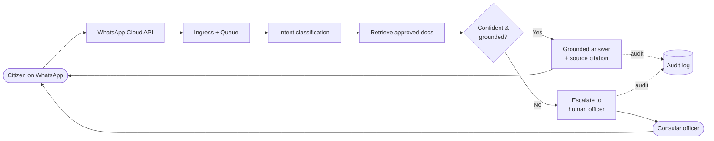

# 1. Executive Overview

## 1.1 What the system is

**ConsulAI is an institutional citizen-attention platform delivered over WhatsApp.** It is the
embassy's official digital front desk: a controlled, auditable assistant that answers citizens'
consular questions using **only the embassy's approved information**, around the clock, in the
citizen's language.

It is explicitly **not a chatbot** in the consumer sense. A consumer chatbot is optimized to always
produce a fluent answer. ConsulAI is optimized to produce a *correct, sourced, and accountable*
answer — or to gracefully decline and route the citizen to a human. The difference is architectural,
not cosmetic: ungrounded answers are structurally blocked.

| Generic chatbot | ConsulAI institutional platform |
|---|---|
| Answers everything, confidently | Answers only what official documents support |
| No source attribution | Every answer cites document + version |
| Hallucinates under uncertainty | Escalates or defers under uncertainty |
| No audit trail | Immutable, exportable audit log |
| One model, no controls | Confidence thresholds, moderation, human takeover |
| Built for engagement | Built for institutional trust and liability control |

## 1.2 How it works (90-second version)

1. A citizen messages the embassy's official WhatsApp number.
2. The system classifies the **intent** (e.g., "passport renewal", "visa requirements", "office
   hours") and detects language.
3. A **retrieval-augmented generation (RAG)** pipeline pulls the most relevant passages from the
   embassy's **approved, versioned knowledge base** (official PDFs, FAQs, announcements).
4. The model composes an answer **strictly from those passages**, with a **confidence score** and a
   **source citation**.
5. If confidence is high → the citizen gets a clear, sourced answer. If confidence is low, the topic
   is sensitive, or no approved source exists → the conversation **escalates to a human officer** (or
   is deferred with official contact details).
6. Everything is **logged** for audit, analytics, and continuous improvement.

## 1.3 Why it is valuable for embassies

Embassies and consulates face a structural problem: **high volume of repetitive questions** against
**limited, expensive consular staff**, with **zero tolerance for misinformation** (wrong consular
advice has legal and reputational consequences).

ConsulAI addresses all three at once:

- **Deflects repetitive volume.** A large share of consular contacts are FAQs — office hours,
  document requirements, appointment processes, fee schedules, emergency contacts. The platform
  resolves these automatically, freeing officers for complex cases.
- **Operates 24/7 across time zones.** Citizens in distress (lost passport, emergencies) get
  immediate official guidance and the right escalation path at any hour.
- **Eliminates the "wrong answer" risk** that blocks most institutions from adopting AI: answers are
  grounded in approved documents and refuse to guess.
- **Creates a managed, branded official channel** — citizens stop relying on unofficial Facebook
  groups and rumor for consular procedures.

## 1.4 How it reduces operational burden

| Burden today | How ConsulAI reduces it |
|---|---|
| Officers answer the same questions by phone/email all day | Automated, instant, sourced answers deflect FAQ volume |
| After-hours and weekend gaps | 24/7 coverage with escalation queue for officers next business day |
| No visibility into what citizens actually ask | Analytics dashboard surfaces demand trends, gaps, and spikes |
| Misinformation spreads in unofficial channels | One authoritative, official, always-current channel |
| Manual triage of who needs a human | Automatic intent + confidence routing; humans only see what matters |
| Updating guidance means re-emailing staff | Update one approved document → answer changes everywhere instantly |

**Indicative outcome (to validate in pilot):** deflection of 50–70% of inbound FAQ-type contacts,
with measurable reduction in average response time from hours/days to seconds for routine questions.
These targets become contractual KPIs in the pilot phase.

## 1.5 Why institutions will trust it

Trust is the entire product. The platform is engineered around the specific objections a government
legal/communications office will raise:

- *"What if it says something wrong?"* → It can only answer from approved documents; below a
  confidence threshold it refuses and escalates. Every answer is sourced.
- *"Who approved this content?"* → Answer-approval workflow: only published, officer-approved
  documents are retrievable. Full version history.
- *"Can we prove what it told a citizen?"* → Immutable audit log of every message, retrieval, and
  decision, exportable for legal/records purposes.
- *"What about sensitive or political topics?"* → Topic restriction lists force escalation or a
  standard deferral; the AI never improvises on sensitive matters.
- *"What about data privacy?"* → Data minimization, encryption, regional hosting options, retention
  policies, and (later) sovereign-hosting compatibility for government contracts.
- *"What if it goes down?"* → Graceful degradation to a static FAQ + human queue; the embassy is
  never left without a channel.

## 1.6 Positioning statement

> **ConsulAI is the official digital consular desk.** It is an institutional citizen-attention
> platform that turns an embassy's approved documents into instant, sourced, multilingual answers on
> WhatsApp — with human officers always in control and a complete audit trail. It is built to the
> standard governments require: controlled, traceable, and accountable.

This positioning — *institutional platform, not chatbot* — is also the **commercial moat**. It lets
us sell to the legal/procurement office, not just the IT team, and justifies annual institutional
licensing rather than per-message consumer pricing.
