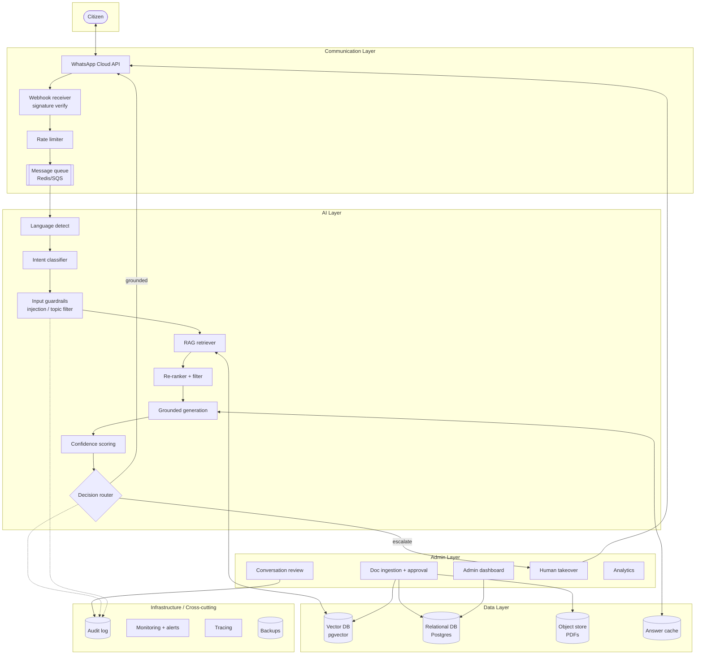
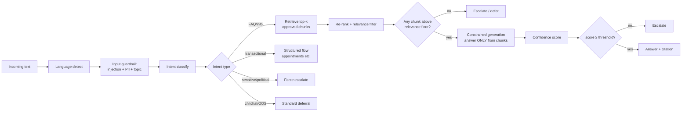
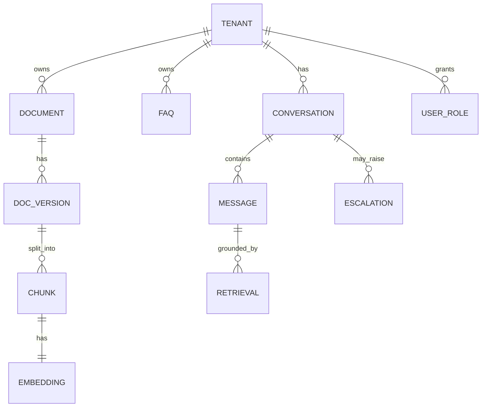
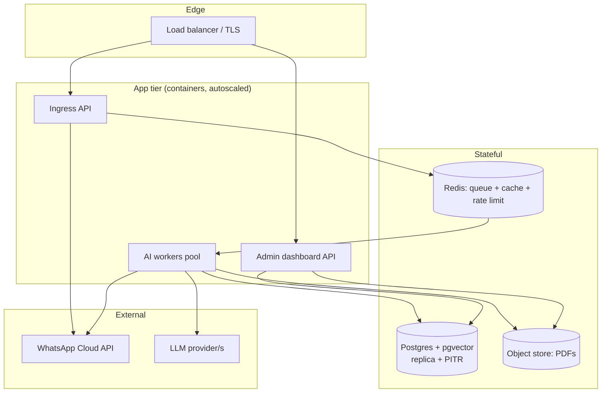

# 2. System Architecture

The architecture is designed to be **buildable by a small team (2–4 engineers)** using managed
services, while meeting government expectations for security, traceability, and reliability. It is
organized in five layers: **Communication, AI, Data, Admin, Infrastructure.**

## 2.1 High-level system diagram



## 2.2 Request lifecycle (sequence)

```mermaid
sequenceDiagram
    participant Cit as Citizen
    participant WA as WhatsApp Cloud API
    participant API as Ingress API
    participant Q as Queue
    participant W as Worker
    participant AI as AI Pipeline
    participant DB as Vector/SQL
    participant Off as Officer

    Cit->>WA: Sends message
    WA->>API: Webhook (signed)
    API->>API: Verify signature, dedupe
    API->>Q: Enqueue job, 200 OK fast
    API-->>WA: 200 (ack within 5s)
    Q->>W: Dequeue
    W->>AI: Detect lang + intent + guardrails
    AI->>DB: Retrieve approved chunks (tenant-scoped)
    DB-->>AI: Top-k passages + metadata
    AI->>AI: Re-rank, ground, score confidence
    alt High confidence + grounded
        AI->>WA: Send sourced answer
        WA->>Cit: Answer + source citation
    else Low confidence / sensitive / no source
        AI->>Off: Create escalation ticket
        AI->>WA: "Connecting you to an officer..."
        Off->>WA: Human reply (takeover)
        WA->>Cit: Human answer
    end
    W->>DB: Write audit record
```

## 2.3 Communication Layer

Handles all WhatsApp I/O reliably under bursty load.

- **WhatsApp Cloud API (Meta)** — the official, hosted WhatsApp Business API. Preferred over
  on-prem/BSP-hosted because Meta runs the infrastructure; we integrate via REST + webhooks. (A
  Business Solution Provider, e.g., Twilio/360dialog, is an alternative if the embassy wants managed
  number provisioning — see §7.)
- **Webhook receiver** — a thin, fast endpoint that (1) verifies the `X-Hub-Signature-256` HMAC,
  (2) deduplicates by message ID (Meta retries), (3) enqueues, and (4) returns `200` within Meta's
  ~5s window. **No heavy work in the webhook** — that's the cardinal rule.
- **Message queue** (Redis Streams / AWS SQS) — decouples ingestion from processing so a spike or a
  slow LLM call never drops messages. Enables retries and backpressure.
- **Rate limiting** — per-citizen (anti-abuse), per-tenant (cost control), and respecting WhatsApp's
  send-rate tiers. Token-bucket in Redis.
- **Retries** — exponential backoff on outbound sends; dead-letter queue for poison messages;
  idempotency keys to avoid double-sending.
- **24-hour session window handling** — WhatsApp only allows free-form replies within 24h of the
  citizen's last message; outside it, only approved **message templates**. The send service enforces
  this automatically.

## 2.4 AI Layer

This is where "controlled, not creative" is enforced. The pipeline is a **deterministic state
machine** around the model, not a single open-ended prompt.



- **Intent classification** — fast, cheap classifier (small LLM or fine-tuned embedding classifier)
  maps each message to a controlled intent taxonomy (passport, visa, registration, notarial,
  emergencies, hours/location, fees, appointments, sensitive/political, out-of-scope). Intent drives
  routing *before* any generation.
- **RAG pipeline** — embed the query → vector search the **tenant-scoped, approved** corpus → return
  top-k passages with metadata (doc id, version, page, effective date).
- **Retrieval filtering** — hard filters applied *before* ranking: tenant id, `status = approved`,
  `not expired`, language. A **relevance floor**: if the best chunk's similarity is below a threshold,
  treat as "no source" and escalate — this is a primary hallucination guard.
- **Prompt control** — a locked system prompt instructs: *answer only from the provided context;
  if the context does not contain the answer, say you don't know and offer escalation; never invent
  procedures, fees, dates, or legal advice; always include the source.* Context is injected; the
  model has no tools to browse or improvise.
- **Hallucination prevention** — combination of: relevance floor, "answer only from context" prompt,
  **citation requirement** (the answer must reference a retrieved chunk or it's rejected), and an
  optional **groundedness check** (a second cheap LLM/NLI pass verifying the answer is entailed by the
  cited passage).
- **Confidence scoring** — composite of retrieval similarity, re-ranker score, intent classifier
  certainty, and groundedness check. Compared against per-intent thresholds (sensitive intents have
  high thresholds → more escalation).
- **Escalation logic** — deterministic rules (see §3.4) decide answer vs. escalate vs. defer.

## 2.5 Data Layer

- **Vector database** — **pgvector on Postgres** for the MVP (one database to operate, transactional
  consistency between content and embeddings, native multi-tenant row filtering). Migrate to a
  dedicated store (Qdrant/Pinecone) only if scale demands — see §7/§8.
- **Structured FAQs** — curated Q→A pairs in Postgres, embedded alongside documents; highest-priority
  retrieval source because they are explicitly approved answers.
- **Official PDFs** — stored in object storage (S3/R2); parsed into semantic chunks (see §5) with
  embeddings in pgvector.
- **Metadata tagging** — every chunk carries: `tenant_id`, `source_doc_id`, `version`, `language`,
  `topic/intent`, `effective_date`, `expiry_date`, `status` (draft/approved/archived), `page`,
  `checksum`. Metadata powers filtering, citations, expiry, and audit.
- **Multilingual support** — store source language + translations; embed per language. Detect query
  language; retrieve in the query language with fallback to the canonical (Spanish) source plus
  on-the-fly translation of the answer if a localized version doesn't exist.



## 2.6 Admin Layer

A web dashboard (see §6) for embassy staff: document upload + approval, FAQ editing, live
conversation review, **human takeover**, announcements, analytics, and role-based permissions. The
Admin Layer writes to the same Data Layer; published/approved content is what the AI Layer can
retrieve — content and serving are the same source of truth.

## 2.7 Infrastructure / cross-cutting

| Concern | Approach |
|---|---|
| **Hosting** | Managed PaaS (Railway/Render/Fly.io) or a single cloud (AWS/GCP) region close to users; containerized services. Sovereign/on-prem option later (§10). |
| **Scalability** | Stateless API + worker pools scale horizontally; queue absorbs bursts; DB read replicas + connection pooling. See §8. |
| **Backups** | Automated daily Postgres snapshots + PITR; object-store versioning for PDFs; tested restore runbook. |
| **Monitoring** | Health checks, uptime monitor, latency/error dashboards (Grafana/Datadog/Better Stack), cost dashboards per tenant. |
| **Observability** | Distributed tracing (OpenTelemetry) across webhook→queue→AI→send; every request has a correlation id present in logs and audit. |
| **Logging** | Structured JSON logs + **separate immutable audit log** (append-only, WORM/retention-locked) for compliance. |
| **Failover** | Graceful degradation: if the LLM provider is down, fall back to FAQ-only exact/semantic match + "an officer will follow up"; multi-provider LLM abstraction (§7) avoids single-vendor outage; queue means no message loss during partial outages. |

## 2.8 Deployment topology (MVP)



**Why this is realistic:** three stateful services (Postgres, Redis, object store) and two stateless
tiers. No Kubernetes required for the MVP; a small team can run this on a managed PaaS and graduate to
managed cloud services as tenants grow.
