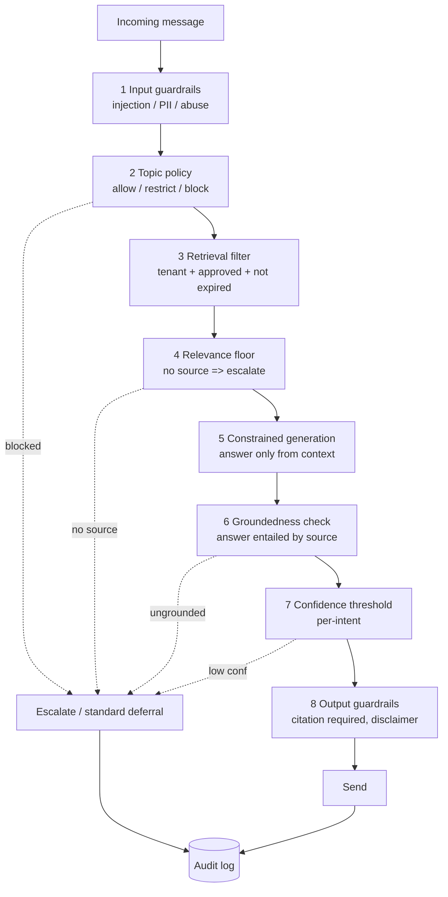

# 3. Government / Institutional Safety Design

Safety is the product's core value proposition. This section specifies the concrete mechanisms that
make the platform acceptable to a government legal/communications office. The guiding rule:

> **Grounded or silent.** The system answers only what approved sources support, above a confidence
> threshold, on permitted topics — otherwise it escalates or defers. There is no path to free-form
> generation.

## 3.1 Defense-in-depth overview



Each layer is independent; a failure of one does not open the door. Multiple layers must *all* pass
for an automated answer to reach the citizen.

## 3.2 Mechanism specifications

### Avoid misinformation
- **Retrieval-grounded only.** Generation receives a context window of approved passages and a system
  prompt that forbids using outside knowledge. No web/tool access.
- **Citation requirement.** The pipeline rejects any answer that does not reference at least one
  retrieved chunk. Citizens see the source ("Source: Consular Fees Schedule, v3, eff. 2026-01-15").
- **Groundedness verification.** An optional second-pass NLI/LLM check confirms the drafted answer is
  *entailed* by the cited passage; non-entailed answers are blocked and escalated.
- **Numbers & dates protection.** Fees, dates, addresses, and legal deadlines are treated as
  high-risk slots; if not verbatim-supported by a source, the answer is suppressed.

### Prevent unauthorized answers
- Only documents with `status = approved` (via the approval workflow, §5) are retrievable. Drafts are
  invisible to the AI.
- **Topic allow-list per tenant.** Intents map to one of: `auto-answer`, `answer-with-disclaimer`,
  `escalate-only`, `block`. The embassy decides this matrix; defaults are conservative.

### Restrict sensitive topics
- A configurable **restricted-topic list** (e.g., asylum decisions, individual case status, legal
  advice, political opinions, anything touching national security or a named individual's data)
  forces escalation or a standard deferral message — never an improvised answer.
- Detection via intent classifier + keyword/regex + embedding similarity to restricted exemplars.

### Prevent prompt injection
- **Structural isolation:** retrieved document text and citizen text are placed in clearly delimited,
  labeled context blocks; the system prompt instructs the model to treat all message/document content
  as data, never as instructions.
- **Input guardrail** screens for injection patterns ("ignore previous instructions", role-play
  jailbreaks, attempts to extract the system prompt).
- **Least privilege:** the model has no tools, no ability to change configuration, and no access to
  other tenants' data — even a successful injection cannot exfiltrate data or take actions.
- **Output filter** blocks responses that leak system prompt, internal IDs, or other tenants' content.

### Ensure answer traceability
- Every automated answer stores: query, detected language/intent, retrieved chunk IDs + versions +
  similarity scores, the exact prompt+context sent, the model + model version, confidence, and the
  final text. Given a citizen complaint, staff can reconstruct *exactly* why the system said what it
  said.

### Maintain legal disclaimers
- Per-tenant configurable disclaimer appended where required (e.g., "This is general information, not
  legal advice. For your specific case contact the consulate."). Onboarding includes a one-time
  notice that the channel is an automated official service with human escalation.

### Audit logs
- **Append-only, immutable** audit store (retention-locked object storage or DB with no UPDATE/DELETE
  grants for the app role). Records every message, decision, retrieval, admin action (who approved
  what, who took over, who disabled an answer), and configuration change. Exportable for records/
  legal requests. Retention configurable per institution's records policy.

## 3.3 Confidence thresholds

Confidence is a **composite score** in `[0,1]`:

```
confidence = w1 * retrieval_similarity_top1
           + w2 * reranker_score
           + w3 * intent_classifier_certainty
           + w4 * groundedness_check_pass
```

Thresholds are **per-intent** and tenant-configurable. Sensitive intents demand near-certainty:

| Intent class | Auto-answer threshold | Behavior below threshold |
|---|---|---|
| Office hours / location / contact | 0.55 | Defer with official contact |
| Document requirements / fees | 0.70 | Escalate to officer |
| Appointment / procedure steps | 0.70 | Escalate to officer |
| Legal / case status / sensitive | n/a (never auto) | Always escalate |
| Out-of-scope / chitchat | n/a | Standard deferral message |

Thresholds are tuned during the pilot against a **labeled evaluation set** (see §5 / §11) and are
themselves versioned and audited.

## 3.4 Fallback mechanisms

Ordered fallback ("never leave the citizen stranded, never guess"):

1. **Localized grounded answer** (preferred).
2. **Grounded answer in canonical language + auto-translation** if no localized source.
3. **FAQ exact/semantic match** if generation pipeline is degraded.
4. **Standard deferral** with official phone/email/website and office hours, if no source.
5. **Human escalation** for in-scope but low-confidence or sensitive topics.
6. **Graceful degradation message** if the whole AI tier is unavailable: acknowledge, give official
   contacts, and queue for officer follow-up. The citizen always receives *something official and
   useful*.

## 3.5 Escalation rules (decision table)

| Condition | Action |
|---|---|
| Intent ∈ restricted/sensitive list | Escalate to officer (no auto-answer) |
| No retrieved chunk above relevance floor | Defer (no source) or escalate if in-scope |
| Confidence below per-intent threshold | Escalate to officer |
| Groundedness check fails | Block answer → escalate |
| Citizen explicitly asks for a human | Immediate escalation |
| Detected distress/emergency keywords | Priority escalation + emergency contact info immediately |
| Injection/abuse detected | Refuse, log, rate-limit; no escalation needed |
| Repeated low-confidence in one session | Escalate after N (config) failed turns |

Escalation creates a ticket in the Admin Layer with full context, assigns/queues it per routing rules
and business hours, and (optionally) tracks an **SLA** (see roadmap upgrade module §11). The citizen
gets an honest holding message with expected response window.

## 3.6 Safety evaluation & continuous assurance

- **Pre-launch red-team**: curated adversarial set (injection, sensitive-topic probing, out-of-date
  info, multilingual edge cases). The system must escalate/refuse, not guess.
- **Golden evaluation set**: labeled Q→expected-source pairs run on every content/config change to
  detect regressions (groundedness, citation correctness, escalation correctness).
- **Shadow review**: in early operation, a sample of auto-answers is queued for officer spot-review;
  officers can flag and one-click **disable a problematic answer/source**, instantly removing it from
  retrieval.
- **Drift monitoring**: alerts on rising escalation rates, falling confidence, or new unmatched intent
  clusters (signals the knowledge base has a gap to fill).
