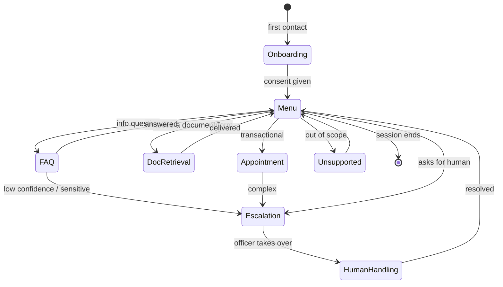

# 4. WhatsApp Conversation Design

Conversation design embodies the institutional tone: **clear, official, concise, and honest about
limits.** WhatsApp constraints shape the UX: a 24-hour free-form session window, approved templates
for re-engagement, interactive list/button messages, and no rich layout. Designs below use plain
text + interactive buttons/lists where helpful.

## 4.1 Conversation state machine

## 4.2 Onboarding flow (first-ever contact)

Goals: identify as official, set expectations (automated + human escalation), capture language &
consent, offer the menu.

> **🇨🇴 Embajada de Colombia en Costa Rica — Atención al Ciudadano**
> Hola, soy el asistente oficial de información consular. Le brindo información basada **únicamente en
> documentos oficiales de la Embajada** y puedo conectarle con un funcionario cuando sea necesario.
>
> Este es un canal automatizado. *No comparta datos sensibles que no le sean solicitados.*
>
> ¿En qué idioma prefiere continuar?
> `[Español]` `[English]`

After language selection:

> Perfecto. ¿Cómo puedo ayudarle hoy?
> `[📋 Trámites y requisitos]` `[🕒 Horarios y ubicación]` `[📄 Formularios y documentos]`
> `[👤 Hablar con un funcionario]`

Consent/notice is shown once; subsequent contacts skip straight to the greeting + menu.

## 4.3 Greeting flow (returning citizen, within reason)

> Hola de nuevo 👋 Soy el asistente oficial de la Embajada. ¿En qué puedo ayudarle?
> `[📋 Trámites]` `[🕒 Horarios]` `[📄 Documentos]` `[👤 Funcionario]`

The citizen can also just type a question freely — the intent classifier routes it. The menu is a
convenience, not a wall.

## 4.4 FAQ flow (grounded answer)

Example — **office hours** (high-confidence, low-risk):

> **Citizen:** ¿A qué hora abren?
>
> **ConsulAI:** La Embajada de Colombia en San José atiende al público de **lunes a viernes, 8:00 a
> 13:00**. Para trámites consulares se recomienda **cita previa**.
> 📎 *Fuente: Información General de Atención, v4 (vigente desde 2026-01-10).*
> ¿Desea agendar una cita o necesita algo más? `[Agendar cita]` `[Otra consulta]`

Example — **document requirements** (higher threshold, still grounded):

> **Citizen:** Qué necesito para renovar el pasaporte?
>
> **ConsulAI:** Para la **renovación de pasaporte** debe presentar:
> 1. Cédula de ciudadanía colombiana vigente.
> 2. Pasaporte anterior (si lo tiene).
> 3. Comprobante de pago del derecho consular.
> 4. Cita previa agendada.
> 📎 *Fuente: Guía de Pasaportes, v6 (vigente desde 2026-03-01).*
> Los **costos** y formas de pago están aquí: `[Ver tarifas]`. ¿Le ayudo a agendar la cita?
> `[Agendar]` `[Hablar con funcionario]`

The answer is concise, enumerated, **sourced**, and offers next steps including escalation.

## 4.5 Document retrieval flow

> **Citizen:** Necesito el formulario de registro civil.
>
> **ConsulAI:** Aquí tiene el **Formulario de Registro Civil de Nacimiento** (PDF oficial):
> 📄 [registro_civil_nacimiento_v2.pdf]
> 📎 *Documento oficial, v2 (vigente desde 2025-11-01).*
> Instrucciones de diligenciamiento: `[Ver instrucciones]`. ¿Necesita algo más?

The system sends the **exact approved file** from object storage (or an official link), never a
re-generated or summarized version of a legal form. Forms are delivered as documents, with optional
grounded instructions.

## 4.6 Escalation-to-human flow

Triggered by low confidence, sensitive topic, explicit request, or emergency.

> **Citizen:** Perdí mi pasaporte y mi vuelo sale mañana, ¿qué hago?
>
> **ConsulAI:** Lamento la situación. Esto requiere atención de un **funcionario consular**.
> 🚨 **Emergencias (24h):** +506 XXXX-XXXX
> Mientras tanto, le comparto la guía oficial para **pérdida de documentos**: `[Ver guía]`.
> He **escalado su caso** a un funcionario. Le responderán en este chat lo antes posible
> (horario de atención: L–V 8:00–13:00). ¿Desea agregar algún detalle para el funcionario?

On the officer side, the dashboard receives a ticket with full transcript + detected intent. When the
officer **takes over**, the citizen is told they are now speaking with a person:

> 👤 *Le atiende ahora un funcionario de la Embajada.*

When resolved, control can return to the assistant.

## 4.7 Unsupported-question flow (out of scope / no source)

Honest, never improvised:

> **Citizen:** ¿Me recomiendas un buen abogado de inmigración en San José?
>
> **ConsulAI:** No puedo recomendar proveedores privados ni ofrecer asesoría legal individual. Puedo
> darle **información oficial** sobre trámites consulares, o conectarle con un funcionario para su
> caso. ¿Cómo prefiere continuar? `[Información oficial]` `[Hablar con funcionario]`

And when there's simply no approved source:

> **ConsulAI:** No tengo información oficial confirmada sobre eso en este momento, y prefiero no darle
> datos sin verificar. Puede comunicarse directamente: ☎️ +506 XXXX-XXXX · ✉️ correo@... · 🌐 sitio
> oficial. ¿Desea que escale su consulta a un funcionario? `[Sí, escalar]` `[No, gracias]`

## 4.8 Re-engagement outside the 24h window

If an officer needs to follow up after the WhatsApp 24h window, the system uses a **pre-approved
template message** (Meta-approved), e.g.:

> *Embajada de Colombia: un funcionario tiene una respuesta a su consulta sobre {tema}. Responda a
> este mensaje para continuar la conversación.*

## 4.9 Tone & content rules (style guide)

- **Official, warm, concise.** No slang, no emojis beyond a small functional set, no humor on
  sensitive matters.
- **Always sourced** for factual claims; always offer a next step.
- **Honest about limits**; never fabricate to seem helpful.
- **Accessibility**: short sentences, numbered steps, plain language; avoid bureaucratic jargon where
  possible while staying accurate to the source.
- **Multilingual parity**: the same flows exist per supported language; the assistant continues in
  the citizen's chosen language and can switch on request.
- **Voice notes** (roadmap upgrade): when a citizen sends an audio note, transcribe → treat as text →
  reply in text (or audio if enabled), with a note that the message was transcribed.
