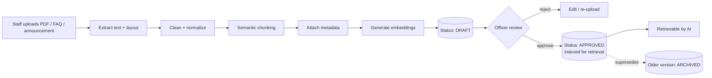
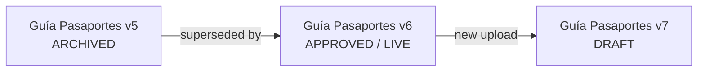
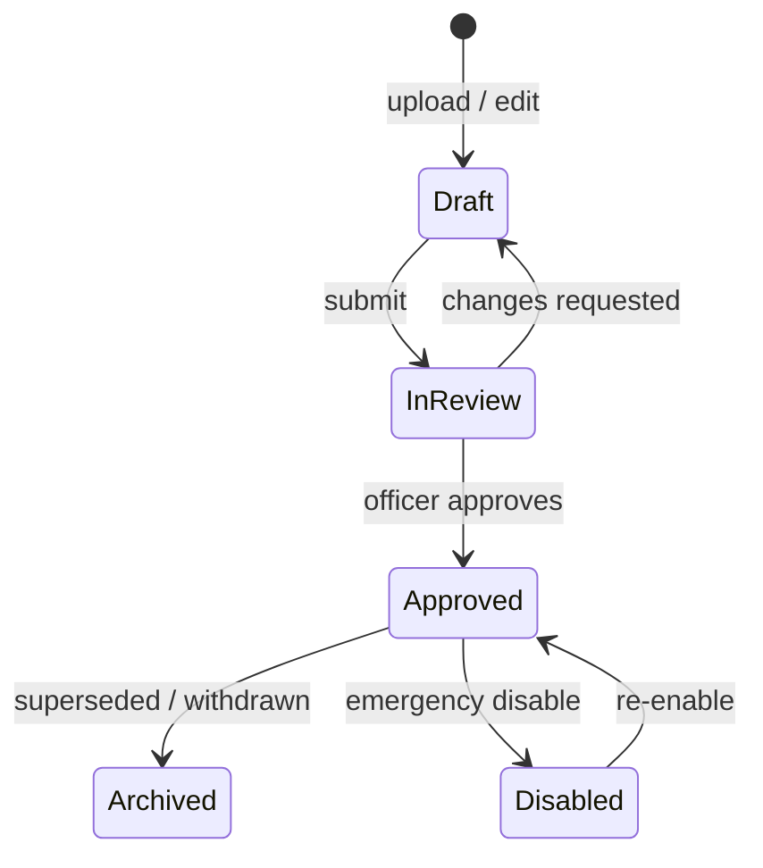

# 5. Knowledge Base Strategy

The knowledge base (KB) is the single source of truth the AI is allowed to use. Its integrity *is*
the platform's integrity. Strategy goals: **only approved content is served, every chunk is
traceable, outdated content cannot leak, and embassy staff can update safely without engineering
help.**

## 5.1 Ingestion pipeline

Key property: **content enters as DRAFT and is invisible to the AI until an authorized officer
approves it.** Approval is the gate between "uploaded" and "served."

## 5.2 PDF parsing

Official consular documents are heterogeneous (text PDFs, scanned forms, tables of fees). Pipeline:

1. **Type detection** — native-text vs. scanned image.
2. **Native text** → extract with a layout-aware parser (preserve headings, lists, tables).
3. **Scanned/image** → OCR (e.g., Tesseract / cloud OCR / a vision model) with a quality/confidence
   score; low-confidence pages are flagged for human verification before approval.
4. **Table handling** — fee schedules and requirement tables are extracted as structured rows so
   numbers stay intact and are not split mid-table.
5. **Normalization** — Unicode/accents, whitespace, header/footer stripping, page-number removal.
6. **Provenance** — store the original file (object storage, immutable, checksummed) so the citizen-
   facing form is always the *real* approved file, not a reconstruction.

## 5.3 Semantic chunking

- **Structure-aware splitting**: chunk on document structure (sections, headings, list groups, table
  rows) rather than blind fixed-size windows, so a "requirements" list or a fee row stays intact.
- **Target size** ~300–600 tokens with small overlap; never split a table row, a fee, or a numbered
  requirement across chunks.
- **Context enrichment**: prepend a short breadcrumb to each chunk (`Document: Guía de Pasaportes >
  Sección: Renovación`) to improve retrieval and make citations self-describing.
- **FAQ chunks**: each approved Q→A pair is its own chunk, tagged as `source_type = faq` and given a
  retrieval priority boost (explicitly approved answers beat document passages on ties).

## 5.4 Embeddings strategy

- **Multilingual embedding model** so a Spanish query can match Spanish source and an English query
  can match English source; store the model name + version with each embedding (re-embedding on model
  change is a tracked migration).
- **Per-language embeddings**: store source-language chunks and any approved translations separately,
  each embedded; retrieval prefers the query language, falls back to canonical Spanish.
- **Hybrid retrieval**: combine dense vector search with keyword/BM25 (Postgres full-text) for exact
  terms (proper nouns, form codes, fees) — dense alone misses exact identifiers. Fuse + re-rank.
- **Re-ranker**: a cross-encoder or LLM re-ranker reorders top-k for precision before generation.

## 5.5 Version control

- Every document has a lineage of immutable versions. Approving a new version **archives** the prior
  one (it stops being retrievable but is retained for audit).
- A citizen complaint can be reconstructed against the *exact version live at that time* (the audit
  log stores which version answered).
- Rollback = re-approve a prior version (one click), instantly restoring its retrievability.

## 5.6 Approval workflow

- **Roles** (see §6): *Editor* drafts/uploads; *Approver* (consular officer) approves; *Admin*
  manages users/config. An editor cannot publish their own content without an approver in tenants that
  require separation of duties (configurable).
- **Emergency disable**: any approver can instantly pull a document/FAQ from retrieval (e.g., a fee
  changed unexpectedly) — faster than editing; logged with reason.
- **Approval record**: who, when, what version, optional note — all in the audit log.

## 5.7 How embassy staff update content safely

The design assumes **non-technical consular staff**:

- Upload a PDF or edit an FAQ in the dashboard — no code, no embeddings knowledge required; the
  pipeline handles parsing, chunking, and indexing automatically.
- A **preview** shows exactly how the content was chunked and a **test panel** lets staff ask sample
  questions against the *draft* before approving — they see what the AI would answer and its source.
- **Guardrails for staff**: required metadata (effective date, topic, language) before submission;
  warnings on near-duplicate or conflicting content; a checklist before approval.
- **Separation of duties**: drafting and approving can be different people; nothing reaches citizens
  without an approver's action.

## 5.8 Managing outdated information

This is where most institutional AI projects fail. Mechanisms:

| Mechanism | Behavior |
|---|---|
| **Effective & expiry dates** | Every chunk carries `effective_date` and optional `expiry_date`; retrieval filter excludes not-yet-effective and expired content automatically. |
| **Expiry monitoring** (roadmap upgrade) | Dashboard + scheduled job flags content approaching expiry; assigns a review task to the owner; optional auto-archive on expiry with alert. |
| **Review cadence** | Each document has a `review_by` date; overdue docs surface on a "stale content" dashboard. |
| **Supersession** | Approving a new version atomically archives the old, so two conflicting versions are never live at once. |
| **Conflict detection** | On approval, similarity check warns if the new content contradicts existing live content (e.g., two different fee values), prompting reconciliation. |
| **Source-of-truth links** | For volatile data (fees, hours), prefer a single canonical document so updates happen in one place and propagate everywhere. |
| **Gap detection** | Analytics surfaces frequent low-confidence/escalated intents → signals missing or outdated content for staff to add. |

**Net effect:** the AI can only ever serve content that is approved, effective, not expired, and not
superseded — and staff have clear tooling to keep it that way.
