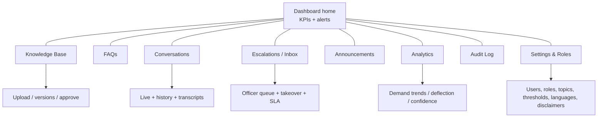
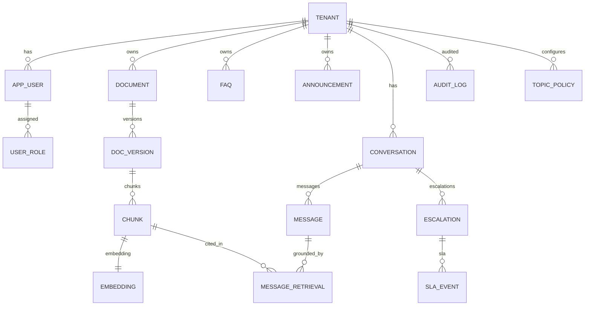

# 6. Admin Dashboard Design

The dashboard is where the embassy *controls* the platform. It must be usable by non-technical
consular staff while exposing the controls a government office needs: content approval, conversation
oversight, human takeover, analytics, and audit.

## 6.1 UI sections (information architecture)



| Section | What staff do here |
|---|---|
| **Dashboard home** | KPIs (messages, deflection rate, avg response time, escalations open, low-confidence rate), active alerts (stale content, error spikes), pending approvals. |
| **Knowledge Base** | Upload/replace PDFs, view version lineage, see chunk preview, run a **test query** against draft, approve/reject, emergency-disable, set effective/expiry/review dates. |
| **FAQs** | Create/edit Q→A pairs, organize by topic, multilingual variants, approve, enable/disable. |
| **Conversations** | Browse/search all conversations, view full transcript with the **source citations and confidence** the AI used, filter by intent/language/outcome. |
| **Escalations / Inbox** | Officer work queue: open tickets with context, assign, **take over** the WhatsApp conversation, reply, resolve, track **SLA** (roadmap upgrade). |
| **Announcements** | Publish official notices (holidays, schedule changes); optionally broadcast via approved WhatsApp templates to opted-in users. |
| **Analytics** | Demand trends, top intents, gap analysis (frequent low-confidence topics), language mix, peak hours, deflection & containment, satisfaction. |
| **Audit Log** | Searchable, exportable record of every answer decision and admin action; filter by user, date, action; export for legal/records. |
| **Settings & Roles** | Manage users/roles, topic policy matrix, confidence thresholds, supported languages, disclaimers, business hours, emergency contacts, escalation routing. |
| **Moderation** (roadmap) | Review-before-publish queue, sampled auto-answer review, flagged-answer handling. |

## 6.2 Key screens — behavior detail

- **Test-before-approve panel** (KB/FAQ): staff type a citizen question and see the *draft* answer +
  the source chunk + confidence, exactly as a citizen would — so they validate content before it goes
  live. This single feature drives staff trust.
- **Human takeover** (Escalations): one click assigns the conversation to the officer and switches the
  WhatsApp thread from AI to human; the citizen is notified. Officer replies are sent as the embassy.
  "Return to assistant" hands control back. All within the WhatsApp 24h window logic.
- **Disable a problematic answer**: from any transcript or KB item, an approver can instantly remove a
  source/FAQ from retrieval with a logged reason — the kill switch for misinformation.
- **Analytics → action loop**: clicking a "frequent low-confidence intent" jumps to "create FAQ /
  upload doc" pre-filled — closing the content gap is one step.

## 6.3 Database schema (core tables)

Conceptual schema (Postgres). All tenant-scoped tables carry `tenant_id`; row-level security enforces
isolation (see §8/§10).



Selected columns:

```sql
-- tenants & users
tenant(id, name, type, locale_default, status, created_at)
app_user(id, tenant_id, email, name, status, last_login_at)
user_role(id, user_id, tenant_id, role)        -- role: admin|approver|editor|officer|viewer

-- knowledge base
document(id, tenant_id, title, source_type, topic, current_version_id, review_by, status)
doc_version(id, document_id, version_no, file_uri, checksum, language,
            effective_date, expiry_date, status,           -- draft|in_review|approved|archived|disabled
            uploaded_by, approved_by, approved_at)
chunk(id, doc_version_id, tenant_id, ordinal, text, breadcrumb, language,
      topic, effective_date, expiry_date, status)
embedding(chunk_id, model, dim, vector vector)              -- pgvector
faq(id, tenant_id, question, answer, topic, language, status, priority,
    approved_by, approved_at)

-- conversations
conversation(id, tenant_id, wa_contact_hash, language, state, assigned_officer_id,
             ai_enabled, created_at, last_msg_at)
message(id, conversation_id, direction, sender, body, intent, language,
        confidence, decision, model, model_version, created_at)
message_retrieval(id, message_id, chunk_id, similarity, rank)   -- traceability
escalation(id, conversation_id, reason, status, assigned_to, opened_at, resolved_at)
sla_event(id, escalation_id, kind, due_at, met)                 -- roadmap upgrade

-- governance
announcement(id, tenant_id, title, body, channels, status, published_at)
topic_policy(id, tenant_id, intent, policy, threshold)          -- policy: auto|disclaimer|escalate|block
audit_log(id, tenant_id, actor_id, action, entity_type, entity_id, before, after, ip, created_at)
```

`audit_log` is **append-only** (no UPDATE/DELETE grant to the app role); `message_retrieval` provides
per-answer traceability; `topic_policy` makes the safety matrix tenant-configurable.

## 6.4 Permissions model (RBAC)

| Role | KB upload | KB approve | FAQ edit | FAQ approve | View convos | Takeover | Disable answer | Analytics | Manage users/config | Audit export |
|---|:--:|:--:|:--:|:--:|:--:|:--:|:--:|:--:|:--:|:--:|
| **Viewer** | – | – | – | – | ✓ | – | – | ✓ | – | – |
| **Editor** | ✓ | – | ✓ | – | ✓ | – | – | ✓ | – | – |
| **Officer** | – | – | – | – | ✓ | ✓ | ✓ | ✓ | – | – |
| **Approver** | ✓ | ✓ | ✓ | ✓ | ✓ | ✓ | ✓ | ✓ | – | – |
| **Admin** | ✓ | ✓ | ✓ | ✓ | ✓ | ✓ | ✓ | ✓ | ✓ | ✓ |

- **Separation of duties**: in tenants that require it, the same user cannot both upload and approve a
  given document version.
- **Least privilege by default**; all role changes are audited.
- **Platform super-admin** (vendor side) sits above tenants for support, with break-glass access that
  is itself heavily audited and time-boxed (see §10).

## 6.5 Design system & UX notes

- Clean, government-appropriate, accessible (WCAG AA), responsive (officers may triage from phones).
- Spanish-first UI with English option; localizable.
- Clear status badges (Draft / In review / Approved / Archived / Disabled) everywhere content appears.
- Destructive/risky actions (approve, disable, broadcast) require confirmation and capture a reason.
- Recommended stack for the dashboard is in §7.
