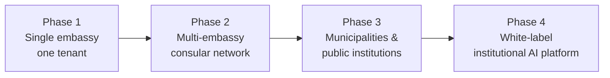
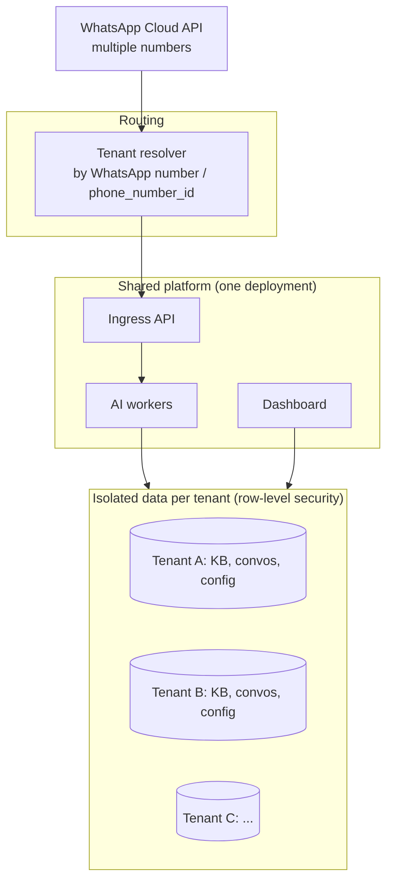

# 8. Scalability Strategy

The platform is designed so the *same* codebase that serves one embassy becomes a **multi-tenant
public-sector SaaS** without a rewrite. Scaling has two axes: **(a) load** (more messages) and **(b)
tenancy** (more institutions).

## 8.1 Evolution path

| Stage | Who | What changes |
|---|---|---|
| **Multi-embassy** | Colombian consulates in other countries; other countries' embassies | Per-tenant KB, branding, number, language mix; shared platform. |
| **Municipal platform** | City halls, citizen services (natural fit with the existing Observatorio Municipal CR work) | Same engine, different document domains; municipal FAQ/forms. |
| **Public-sector SaaS** | Ministries, agencies, utilities | Self-serve onboarding, standardized compliance package. |
| **White-label** | Resellers / integrators deploy under their own brand | Theming, custom domains, reseller billing, per-deployment config. |

## 8.2 Multi-tenant architecture

**Model: shared application, isolated data, per-tenant configuration.**

- **Tenant resolution**: each institution has its own WhatsApp number / `phone_number_id`; inbound
  webhooks are mapped to a `tenant_id` immediately. All downstream queries are tenant-scoped.
- **Per-tenant config**: branding, languages, disclaimers, topic policy, thresholds, business hours,
  escalation routing, LLM provider choice — all data, not code.
- **Shared infra, low marginal cost**: one deployment serves many tenants; adding a tenant is a
  configuration + onboarding task, not a deployment.

## 8.3 Organization isolation (the critical requirement)

Government clients will demand provable isolation: *"Embassy A's data is never visible to Embassy B."*

| Tier | Mechanism | When |
|---|---|---|
| **Logical isolation (default)** | `tenant_id` on every row + **Postgres Row-Level Security**; every query and vector search filtered by tenant; tenant id in object-storage key prefixes; tenant-scoped cache keys. | Standard SaaS tenants. |
| **Schema isolation** | Separate Postgres schema per tenant. | Tenants wanting stronger separation. |
| **Database / deployment isolation** | Dedicated DB or fully dedicated deployment (single-tenant instance). | High-security/sovereign government contracts (premium tier — §9, §10). |

The application code is identical across tiers; only the deployment/isolation configuration changes.
This lets us **sell "dedicated instance" or "sovereign deployment" as a premium SKU** without forking
the product.

## 8.4 Per-client knowledge bases

- Each tenant's documents, FAQs, embeddings, and announcements are fully partitioned by `tenant_id`.
- Vector search **must** include the tenant filter (enforced at the query layer + RLS) — a tenant can
  never retrieve another tenant's chunks. This is covered by automated tests in CI.
- Per-tenant embedding model choice is allowed (some may require an in-region/sovereign model).

## 8.5 Load scaling

| Component | Scaling approach |
|---|---|
| **Ingress API** | Stateless → horizontal autoscale behind LB; webhook returns fast, all heavy work queued. |
| **Workers** | Pool autoscaled on queue depth; concurrency capped per-tenant to prevent noisy-neighbor. |
| **Queue** | Redis Streams/SQS absorbs bursts; per-tenant rate limits; dead-letter for poison messages. |
| **Postgres** | Read replicas for dashboard/analytics; connection pooling (PgBouncer); partition large tables (messages, audit) by tenant/time. |
| **Vector search** | pgvector with HNSW indexes; if a tenant's corpus or QPS grows large, move that tenant (or all) to Qdrant — the abstraction makes this transparent. |
| **LLM** | Provider rate-limit handling, request batching for classification, **answer cache** for repeated FAQs (huge cost saver — many citizens ask identical questions). |
| **Cost** | Cache + small-model classification + grounded short answers keep per-message cost low; per-tenant cost dashboards prevent surprises. |

## 8.6 Usage tracking & metering

Every billable/observable event is recorded per tenant:

- Inbound/outbound messages, AI answers vs. escalations, unique citizens, documents/storage, LLM
  tokens (and cost), template messages sent, active officer seats.
- Aggregated into a **usage ledger** that powers billing, quota enforcement, and the analytics
  dashboard. Soft/hard quota alerts protect against runaway cost and abuse.

## 8.7 Billing strategy (mechanics; pricing in §9)

- **Annual license per tenant** (institution) — primary model, fits government budgeting cycles.
- **Tiers by volume/seats/features**, with metered overage above included quotas.
- **Add-on SKUs**: extra languages, voice notes, dedicated/sovereign instance, premium SLA, extra
  officer seats, integrations.
- **White-label/reseller**: platform fee + per-deployment licensing; resellers manage their own
  sub-tenants.
- Billing data derives from the usage ledger; invoices generated per tenant; supports purchase-order
  / annual-prepay flows that governments require (not just credit-card SaaS).

## 8.8 Multi-region & sovereignty

- Deploy per region (e.g., LATAM region) to keep citizen data in-region and reduce latency.
- For sovereign contracts: dedicated single-tenant deployment in the client's required jurisdiction or
  on-prem, optionally with a local/sovereign LLM — enabled by the provider abstraction and isolation
  tiers above. Sold as the top pricing tier (§9/§10).
