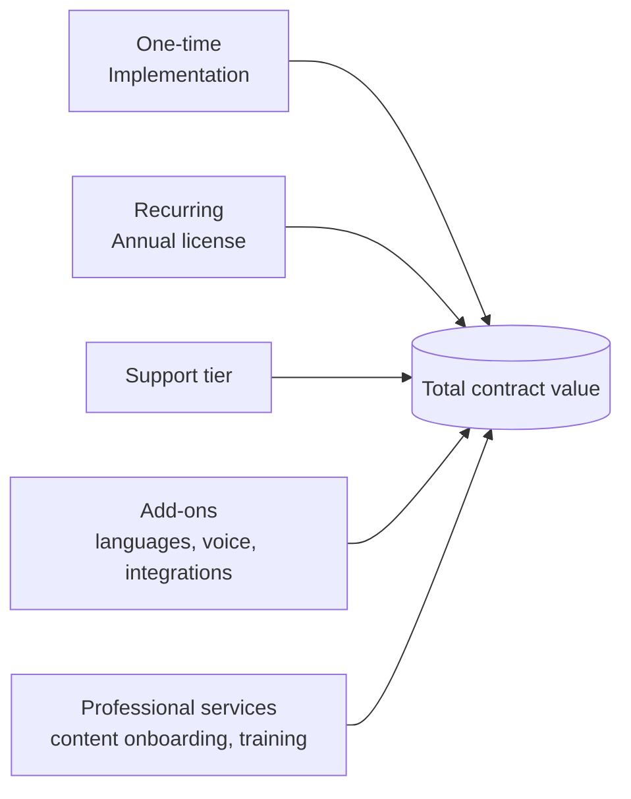
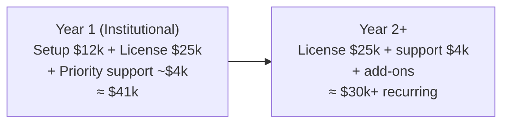

# 9. Pricing Strategy

Pricing targets **government budgeting reality**: institutions buy annual licenses with a clear scope,
prefer predictable costs, and pay for *trust and accountability*, not tokens. The model separates a
one-time **implementation** fee from a recurring **annual license**, plus support and add-ons.

> Figures below are **strategic reference ranges in USD** for positioning and negotiation, not a
> quote. Calibrate to the specific market (Costa Rica / Colombia public-sector budgets), competition,
> and your cost base. Anchor value to **officer hours saved + risk reduced**, not to compute cost.

## 9.1 Revenue components

## 9.2 Implementation (one-time)

Covers WhatsApp onboarding, branding/config, initial knowledge-base ingestion, conversation tuning,
staff training, and go-live.

| Package | Scope | Indicative one-time |
|---|---|---|
| **Pilot / Starter setup** | 1 number, 1–2 languages, curated FAQ + core docs, basic config | **$3,000 – $7,000** |
| **Institutional setup** | Full doc ingestion, approval workflows, escalation routing, staff training, eval set | **$8,000 – $20,000** |
| **Enterprise/government setup** | Compliance package, SSO, dedicated/sovereign deployment, integrations, security review | **$25,000 – $75,000+** |

## 9.3 Annual license (recurring — the core business)

| Tier | Best for | Included (indicative) | Annual license |
|---|---|---|---|
| **Essential** | Single small consulate, pilot-to-production | 1 tenant, 2 languages, up to ~3–5k conversations/mo, 3 officer seats, business-hours support, standard hosting | **$6,000 – $12,000 / yr** |
| **Institutional** | Active embassy | 1 tenant, multi-language, higher volume, 10 seats, analytics, moderation workflows, priority support, SLA 99.5% | **$15,000 – $40,000 / yr** |
| **Government / Enterprise** | High-volume or high-security institution | Dedicated/sovereign instance, SSO/SAML, custom retention, premium SLA 99.9%, named CSM, audit/compliance package | **$50,000 – $150,000+ / yr** |
| **Multi-tenant network** | Foreign ministry / many consulates | N tenants under one master agreement, central admin, volume discount | **Custom (per-tenant × volume discount)** |

Pricing axes that move a deal between tiers: **conversation volume, officer seats, languages,
isolation/hosting tier, SLA, and feature add-ons.**

## 9.4 Support & maintenance tiers

| Tier | Response time | Hours | Includes | Indicative |
|---|---|---|---|---|
| **Standard** | Next business day | Business hours | Bug fixes, content help desk, minor updates | Included in license |
| **Priority** | 4 business hours | Extended | Faster response, quarterly tuning review, uptime SLA 99.5% | +15–20% of license |
| **Critical / Gov** | 1 hour, 24/7 for Sev-1 | 24/7 | Dedicated channel, named CSM, SLA 99.9%, incident reports, security liaison | +25–40% of license |

Maintenance plans cover: model/provider updates, security patches, dependency upkeep, knowledge-base
re-indexing on model changes, and periodic eval-set regression runs.

## 9.5 Add-on SKUs (expansion revenue)

| Add-on | Indicative |
|---|---|
| Each additional language | $1,500 – $4,000 / yr |
| Voice-note transcription | $2,000 – $6,000 / yr |
| CRM / ticketing integration | $3,000 – $10,000 setup + maint. |
| Dedicated / sovereign instance | +50–100% of base license |
| Extra officer seats | $300 – $800 / seat / yr |
| Advanced analytics / demand-trend reports | $2,000 – $5,000 / yr |
| Document expiry-monitoring & content audits | $1,500 – $4,000 / yr |
| Additional conversation volume (overage) | metered per 1k conversations |

## 9.6 Indicative deal economics

- **Year 1** combines implementation + license (higher).
- **Year 2+** is mostly recurring license + support + expansion add-ons — high-margin, predictable.
- **Net revenue retention** grows via languages, voice, integrations, more seats, and additional
  consulates under the same ministry relationship.

## 9.7 Recurring-revenue opportunities

1. **Annual licenses** — the backbone; renews with the institution's budget cycle.
2. **Land-and-expand within a ministry** — one embassy → consular network → ministry-wide. The
   master agreement is the prize.
3. **Cross-institution expansion** — same engine to municipalities (synergy with Observatorio
   Municipal), agencies, utilities.
4. **Add-on attach** — languages, voice, integrations, analytics.
5. **White-label / reseller** — platform fee + per-deployment licensing through integrators in other
   countries.
6. **Professional services** — content onboarding, periodic content audits, training, custom flows.

## 9.8 Pricing principles for government sales

- **Value-based, not cost-plus**: anchor to officer time saved (e.g., X FTE-hours/month deflected)
  and risk reduced (misinformation, missed after-hours contacts).
- **Predictable annual cost**: governments dislike variable bills — generous included quotas with
  clear overage, not pay-per-message anxiety.
- **Procurement-friendly**: support purchase orders, annual prepay, multi-year discounts, and the
  paperwork (security questionnaire, compliance docs) procurement requires.
- **Pilot as a wedge**: a paid, time-boxed pilot (3 months) with success KPIs converts to an annual
  contract; price the pilot to cover setup, not to profit — the annual license is the business.
