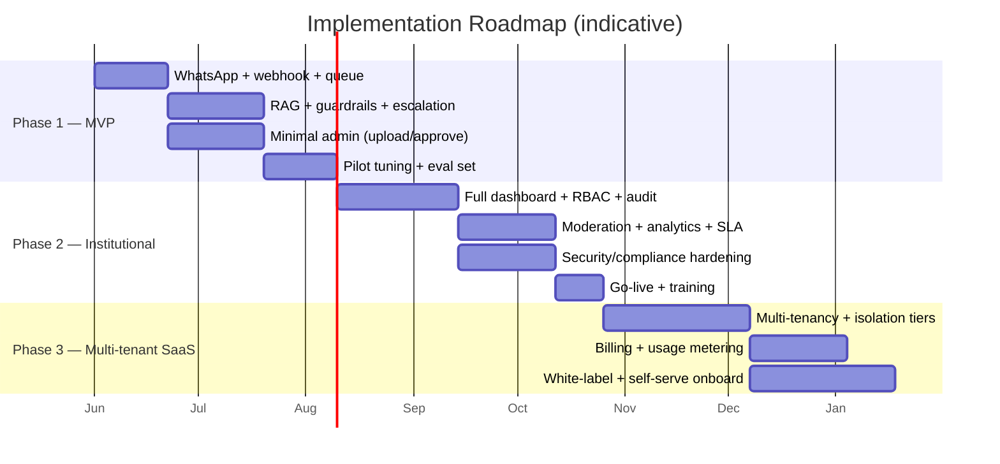
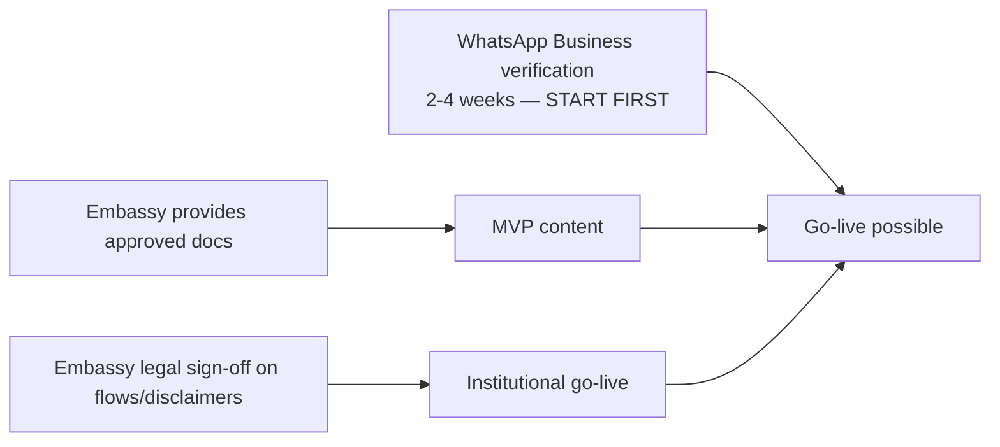

# 11. Implementation Roadmap

Three phases, sequenced to **prove trust first (MVP), harden for the institution (deployment), then
generalize for many clients (SaaS).** Each phase ships something usable; nothing is big-bang.

## 11.1 Phase 1 — MVP (prove it works and is trustworthy)

**Goal:** a single embassy answers real citizen FAQs on WhatsApp, grounded and safe, with human
escalation. ~**8–10 weeks** with a small team.

**Scope / milestones**
- WhatsApp Cloud API integration: webhook (signature verify, dedupe), queue, send service, 24h-window
  handling, rate limiting, retries.
- RAG core: ingestion → chunk → embed → pgvector; retrieval with tenant + approved + relevance-floor
  filters; constrained grounded generation with **citations**.
- Safety MVP: input guardrails, topic policy, confidence threshold, escalation rules, audit logging.
- Minimal admin: upload PDF/FAQ, approve/disable, view conversations, manual human takeover.
- Conversation flows: onboarding, FAQ, document retrieval, escalation, unsupported (§4).
- Eval set + red-team pass; pilot with embassy on a curated KB.

**Exit criteria:** target deflection & groundedness on the eval set met; zero ungrounded answers in
red-team; embassy officers comfortable with takeover; agreed pilot KPIs.

**Complexity:** Medium. The hard parts are guardrail correctness and WhatsApp operational edge cases,
not raw build volume.

## 11.2 Phase 2 — Institutional deployment (harden for one serious client)

**Goal:** production-grade for the embassy. ~**8–12 weeks**.

**Scope / milestones**
- Full admin dashboard: RBAC (5 roles), version control, test-before-approve, announcements,
  conversation review with citations/confidence.
- Moderation & answer-approval workflows; sampled auto-answer review; one-click disable.
- Analytics: demand trends, deflection, confidence/gap analysis, language mix, peak hours.
- **Human-handoff module with SLA tracking** (roadmap upgrade); escalation routing + business hours.
- Multilingual production (ES/EN; add PT/FR as needed); optional **voice-note transcription**.
- Security/compliance hardening: SSO/MFA, secrets management, immutable audit export, retention/purge,
  backups + tested restore, monitoring/observability/alerting, incident-response runbook.
- Document **expiry/version monitoring** (roadmap upgrade).

**Exit criteria:** SLA met in production, security review passed, staff fully self-sufficient on
content, signed annual contract.

**Complexity:** Medium-High (compliance and dashboard breadth drive the effort).

## 11.3 Phase 3 — Multi-tenant SaaS (generalize for many clients)

**Goal:** onboard new institutions with low marginal effort; white-label ready. ~**12–16 weeks**.

**Scope / milestones**
- Multi-tenancy: tenant resolver, per-tenant config, **isolation tiers** (RLS → schema → dedicated),
  cross-tenant access tests in CI.
- Billing & **usage metering** ledger; quotas/overage; invoices; PO/annual-prepay flows.
- White-label: theming, custom domains, reseller/sub-tenant management.
- Self-serve(-ish) onboarding wizard for new institutions; templated compliance package.
- Multi-region / sovereign deployment option; per-tenant LLM provider selection.
- **Multi-consulate / municipality instance management** (roadmap upgrade).

**Exit criteria:** second and third tenants onboarded mostly via configuration; reseller pilot;
unit economics positive per tenant.

**Complexity:** High (isolation correctness, billing, and operational maturity).

## 11.4 Staffing requirements

| Phase | Team | Notes |
|---|---|---|
| **Phase 1** | 1 senior full-stack/AI engineer (lead) + 1 backend/AI engineer; part-time PM/consultant (you) for embassy liaison & content | 2 engineers can ship the MVP. |
| **Phase 2** | +1 frontend engineer (dashboard), +part-time security/DevOps | Compliance + dashboard breadth. |
| **Phase 3** | +1 platform/DevOps engineer, +1 customer-success/onboarding, +sales | Shift from build to scale + go-to-market. |
| **Ongoing** | Customer success + content help desk + on-call rotation | Recurring-revenue support. |

Roles can be wider than headcount early (founders wear hats); the point is the *minimum viable team*
is small and the architecture (§2, §7) is chosen to keep it that way.

## 11.5 Critical path & dependencies

- **Start WhatsApp Business verification on day 1** — it's the longest external dependency and gates
  go-live regardless of build progress.
- **Embassy must supply approved documents** and **legal sign-off** on flows/disclaimers — these are
  client-side critical-path items; manage them actively.

## 11.6 Estimated development complexity (summary)

| Component | Complexity | Risk |
|---|---|---|
| WhatsApp transport + queue | Medium | Operational edge cases (24h window, retries) |
| RAG + guardrails | Medium-High | Getting groundedness/escalation correctness right |
| Admin dashboard | Medium | Breadth, not depth |
| Multi-tenancy + isolation | High | Correctness of isolation; tested in CI |
| Billing/metering | Medium | Edge cases in usage accounting |
| Compliance/security | Medium-High | Mostly process + documentation, ongoing |
