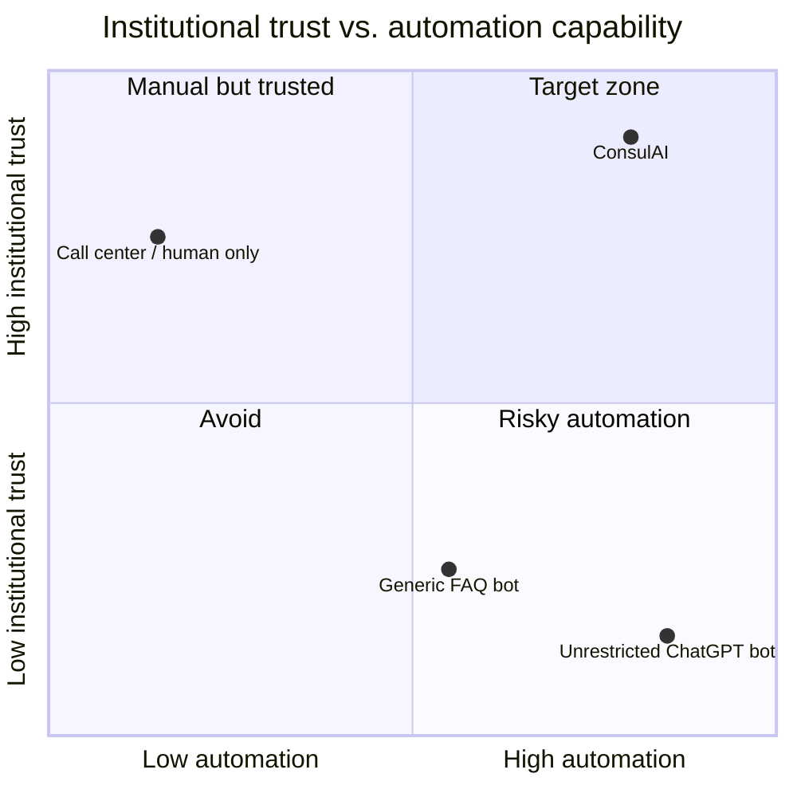

# 12. Competitive Advantage Strategy

The platform wins not on "we have AI" — everyone claims that — but on being the **only option a
government legal/communications office can actually approve.** The moat is *institutional trust by
design*.

## 12.1 Competitive landscape

## 12.2 Differentiation by competitor type

| Competitor | Their weakness | ConsulAI advantage |
|---|---|---|
| **Generic AI chatbots (ChatGPT-style)** | Hallucinate; no source control; no audit; no human escalation; liability risk | Grounded-only, sourced, audited, human-in-the-loop — *approvable by gov legal* |
| **Simple FAQ/keyword bots** | Rigid, miss phrasing, no language understanding, no document retrieval, poor UX | Semantic understanding + multilingual + document delivery + escalation, while staying controlled |
| **Outsourced call centers** | Expensive, business-hours, inconsistent, no analytics, agents may give wrong info | 24/7, instant, consistent sourced answers, full analytics, lower marginal cost; humans focus on complex cases |
| **In-house IT building it themselves** | Slow, no AI/RAG expertise, reinvents guardrails, no roadmap, maintenance burden | Production-ready, safety-engineered, maintained, multi-language, with a product roadmap |
| **Big-tech enterprise AI suites** | Overkill, expensive, generic, not tuned for consular workflows or LATAM gov procurement | Purpose-built for consular/public-sector citizen attention; right-sized; local + procurement-savvy |

## 12.3 The five pillars of the moat

1. **Institutional trust** — designed to pass a government legal/security review: grounded answers,
   disclaimers, human escalation, immutable audit, role-based control. This is the *buying criterion*
   competitors ignore.
2. **Controlled AI** — "grounded or silent." We sell *predictability*, not creativity. The refusal
   behavior is a feature, not a limitation.
3. **Official-data grounding** — answers come only from the embassy's approved documents, with
   citations and version control. The institution's authority is preserved, not diluted.
4. **Analytics & insight** — demand-trend analytics turn citizen questions into operational
   intelligence (staffing, content gaps, emerging needs) — a value the embassy can't get from a call
   center or a generic bot.
5. **Scalability & roadmap** — the same trusted engine extends to consular networks, municipalities,
   and the public sector, with white-label and sovereign-hosting options — a *platform*, not a tool.

## 12.4 Why this is defensible over time

- **Workflow + compliance lock-in (positive)**: once an institution's content, approval workflows,
  audit history, and analytics live in the platform, switching cost is high — and renewal is natural
  on the budget cycle.
- **Domain depth**: consular/public-sector flows, multilingual nuance, procurement know-how, and a
  growing library of vetted institutional patterns are hard for a generic vendor to replicate.
- **Trust track record**: each successful, incident-free deployment becomes a reference that de-risks
  the next government sale — the hardest currency to fake in public-sector B2G.
- **Network expansion**: a foreign-ministry master agreement or a municipal-network deal compounds
  faster than competitors selling one bot at a time.
- **Data advantage (privacy-safe)**: aggregate, anonymized demand patterns improve intent taxonomies,
  flows, and eval sets across deployments — without using citizen data to train third-party models.

## 12.5 Go-to-market wedge

Lead with a **paid, time-boxed pilot** carrying explicit KPIs (deflection %, response time, zero
ungrounded answers). The pilot is cheap to say yes to and converts to an annual contract once the
embassy *sees* the controlled behavior and analytics. Then **land-and-expand**: consular network →
ministry → adjacent institutions. Position every conversation around **trust and accountability**,
because that's the axis where generic AI vendors cannot follow.
