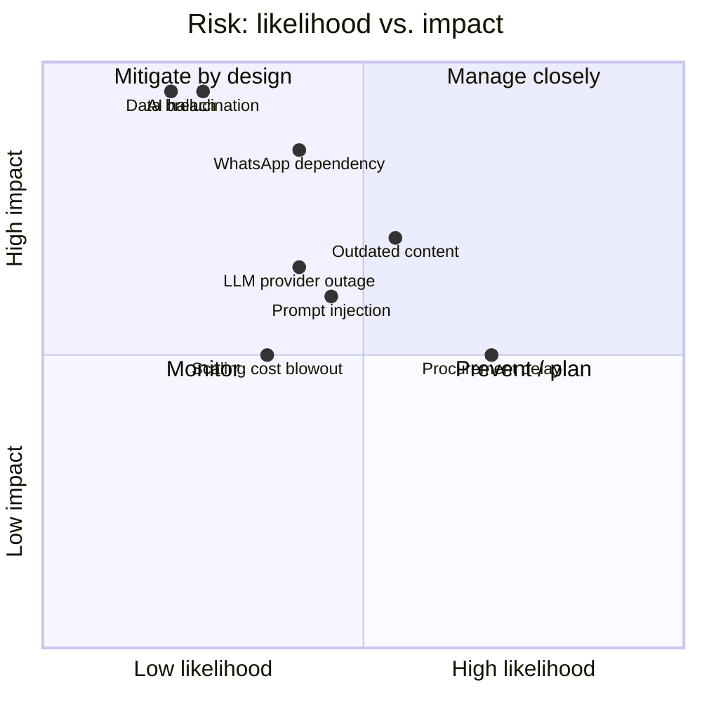

# 14. Risks & Failure Points

A clear-eyed risk register, grouped by category, each with likelihood, impact, and mitigation. The
architecture in §2–§3 already neutralizes the most dangerous AI risks by design; this section makes
the residual risks explicit and owned.

## 14.1 Risk heat map

## 14.2 Operational risks

| Risk | Likelihood | Impact | Mitigation |
|---|---|---|---|
| LLM provider outage/latency | Medium | High | Provider abstraction + failover; FAQ-only degraded mode; queue prevents message loss; status page + alerts. |
| WhatsApp/Meta outage or policy change | Medium | High | Graceful degradation + officer fallback; BSP relationship; monitor Meta policy; abstraction over messaging layer so a second channel (SMS/web widget) can be added. |
| Cost blowout at scale | Low-Med | Medium | Answer cache, small-model classification, per-tenant quotas/alerts, cost dashboards. |
| Outdated/incorrect content served | Medium | High | Effective/expiry dates + retrieval filter, supersession, expiry monitoring, conflict detection, gap analytics (§5). |
| Staff don't maintain KB | Medium | Medium | Easy dashboard, review cadence + stale-content alerts, content help-desk in support tier, onboarding training. |
| Officer escalation queue overwhelmed | Low-Med | Medium | SLA tracking, routing, business-hours expectations set in flows, analytics to staff appropriately. |

## 14.3 Legal & compliance risks

| Risk | Likelihood | Impact | Mitigation |
|---|---|---|---|
| Wrong consular advice → harm/liability | Low (by design) | High | Grounded-only, sensitive-topic escalation, disclaimers, human-in-loop, full audit; shared-responsibility clause in contract. |
| Privacy/data-protection violation | Low | High | Data minimization, encryption, retention/purge, DPAs, no-training provider settings, residency options (§10). |
| Records/transparency obligations | Medium | Medium | Immutable audit log, exportable; align retention with institution's records law. |
| Disclaimer/consent insufficient | Low | Medium | Embassy legal sign-off on flows + disclaimers before go-live (critical-path item, §11). |

## 14.4 AI-specific risks

| Risk | Likelihood | Impact | Mitigation |
|---|---|---|---|
| Hallucination (invented fact/fee/date) | Low (by design) | Critical | Relevance floor, answer-only-from-context, citation requirement, groundedness check, confidence thresholds, never-guess fallback (§3). |
| Prompt injection / jailbreak | Medium | Medium | Structural isolation, input/output guardrails, no tools, least privilege, output leak filter (§3). |
| Sensitive-topic improvisation | Low | High | Topic policy matrix → forced escalation; high thresholds for sensitive intents. |
| Multilingual mistranslation | Medium | Medium | Per-language approved content preferred; translation flagged; eval set per language; escalation on low confidence. |
| Model/version regression on update | Medium | Medium | Pinned model versions, eval-set regression gate before any model swap, staged rollout. |

## 14.5 Dependency & scaling risks

| Risk | Likelihood | Impact | Mitigation |
|---|---|---|---|
| WhatsApp single-channel dependency | Medium | High | Architecture allows adding channels (web widget, SMS) via the same AI core; don't hard-couple to WhatsApp internals. |
| Vendor lock-in (LLM/cloud) | Low-Med | Medium | Abstraction layer, standard Postgres, IaC, documented exit + data export. |
| Multi-tenant isolation bug (data leak) | Low | Critical | RLS + query-layer tenant checks + **automated cross-tenant tests in CI** + dedicated-instance tier for high-security clients. |
| pgvector hits scale ceiling | Low-Med | Medium | Abstraction allows migrating to Qdrant/Pinecone per tenant transparently. |
| Single-person/key-person risk (small team) | Medium | High | Documentation, IaC, runbooks, code review, no undocumented "magic"; cross-training. |

## 14.6 Government procurement risks

| Risk | Likelihood | Impact | Mitigation |
|---|---|---|---|
| Long/uncertain procurement cycle | High | Medium | Lead with a paid pilot (smaller approval); prepare procurement artifacts (security questionnaire, DPA, compliance docs) early; multi-year option. |
| Security/compliance review blocks deal | Medium | High | Pre-built compliance package; documented controls; pen-test on request; path to SOC 2/ISO 27001. |
| Budget cycle / political change | Medium | Medium | Annual licensing aligned to budget cycles; demonstrate ROI in officer-hours; multi-institution diversification. |
| "Build it ourselves" objection | Medium | Medium | Show safety-engineering depth, maintenance burden, and roadmap they can't match in-house; reference deployments. |
| Reference/trust gap (early stage) | High (early) | High | Nail the first deployment incident-free; convert it into a public reference; under-promise/over-deliver on the pilot. |

## 14.7 Top-5 "must-not-fail" controls

1. **No ungrounded answer ever reaches a citizen** (relevance floor + citation + groundedness + threshold).
2. **No cross-tenant data access** (RLS + query checks + CI tests + dedicated tier).
3. **Always an official fallback** when AI/WhatsApp degrades (FAQ-only + officer queue).
4. **Complete, immutable audit trail** for every answer and admin action.
5. **WhatsApp Business verification + embassy legal sign-off on the critical path** — start both day 1.

## 14.8 Residual-risk posture

The design converts the highest-impact risks (hallucination, data breach, wrong advice) into
**low-likelihood-by-construction** risks, leaving the dominant *open* risks as **business/procurement
execution** — which are managed by go-to-market discipline (pilot wedge, compliance readiness,
reference-building) rather than engineering. That is the intended risk profile for a government AI
company: the technology is the safe part; the sales motion is where to spend management attention.
